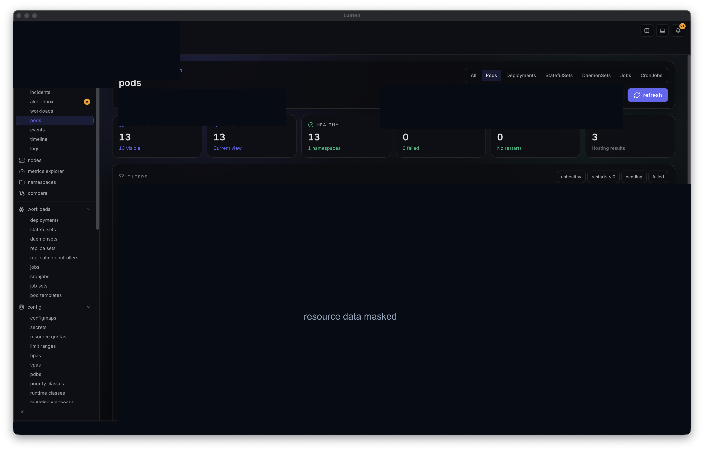

# Lumen Features

Lumen is a local-first Kubernetes desktop workbench. It is built for operators
and developers who want a capable dashboard without routing cluster access
through a hosted control plane.

## Screenshot

This public screenshot was captured from `ms_aks_stage` with resource names,
table rows, and sensitive operational details masked.

## Cluster Fleet

- Discover kubeconfig contexts and switch between clusters.
- Show cluster health, Kubernetes version, node readiness, and soft disconnects.
- Mark production-like contexts clearly so risky actions have stronger context.

## Workload Explorer

- Browse namespaces, workloads, services, storage, RBAC, policy, and custom
  resources from one desktop UI.
- Filter resources by name, namespace, kind, labels, status, images, restart
  count, and ownership.
- Open rich detail drawers with metadata, labels, owner references, events,
  YAML, pod state, metrics, and kind-specific insights.

## Logs, Shell, And Port Forwarding

- Stream logs for pods and workload-owned pods with search, pause/resume, and
  bounded buffers.
- Open pod shell sessions through Kubernetes attach.
- Start and stop port forwards for pods and services from the local machine.

## Change And Incident Workflows

- Inspect rollout timelines, recent changes, events, alerts, and resource
  diffs.
- Generate incident reports with sensitive values redacted.
- Compare resources across clusters when troubleshooting drift.

## Kubernetes Operations

- Apply YAML with server-side dry-run support where available.
- Delete resources with confirmation and RBAC preflight checks.
- Manage Helm releases, including install, upgrade, rollback, and uninstall.
- Browse Argo CD applications, resource trees, history, and sync status.
- Inspect Tekton pipelines, pipeline runs, task runs, and status details.

## Security Defaults

- Lumen reads the user's kubeconfig and talks directly to Kubernetes APIs.
- There is no hosted backend requirement.
- Secret YAML is redacted by default before rendering.
- AI and report workflows redact obvious tokens, credentials, kubeconfig
  material, and secret values before prompt/report construction.
